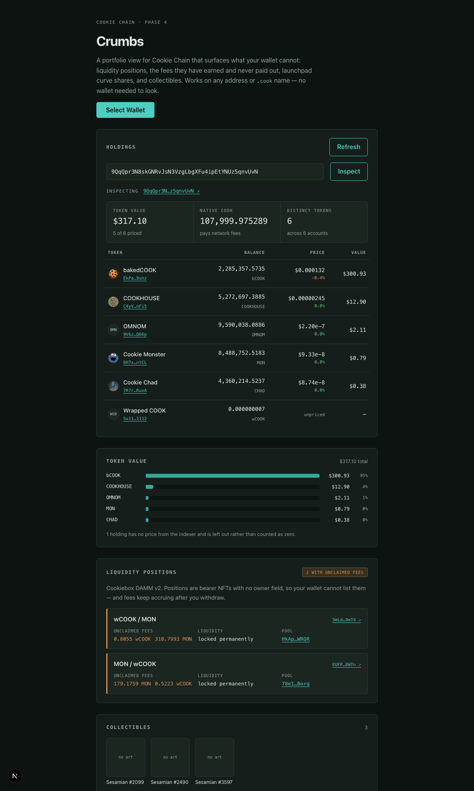

# Crumbs

**A portfolio view for [Cookie Chain](https://www.cookiechain.wtf) that surfaces the
positions your wallet cannot show you — and the fees they left behind.**



Every read is public, so you can inspect any address or `.cook` name without connecting a
wallet: `/?a=moon.cook`.

---

## The problem

Cookie Chain has 22 live apps and no portfolio view. That gap is not an oversight — some
of what a wallet holds is *structurally invisible* to it.

**A Cookiebox DAMM v2 liquidity position has no owner field.** Not a hard-to-read one: the
account does not contain one. Ownership is bearer — whoever holds the position NFT owns the
position — so there is nothing for a wallet to query. Meanwhile fees keep accruing to
positions people withdrew from months ago.

As of 10 Sep 2026: **176 positions across 15 pools, 27 carrying unclaimed fees**, most with
no liquidity remaining.

**Launchpad buys have the same problem for a different reason.** Before a pool graduates
your stake is a program-tracked share, not an SPL token. The sponsor's own `cookie-mcp`
says so plainly: *"program-tracked curve shares, not SPL tokens — they do not appear in
`get_balance`."*

Crumbs reads all of it, and lets you claim what is owed.

## Running it

```bash
npm install
npm run dev
```

Open <http://localhost:3000>. No `.env.local` is needed — the defaults in
[`src/lib/chain.ts`](src/lib/chain.ts) point at the public Cookie Chain endpoints; copy
`.env.local.example` to override them.

To claim, you need [Nightly](https://nightly.app) with Cookie Chain added as a custom SVM
network (RPC `https://rpc.cookiescan.io`) and a little COOK for fees — bridge it from
Solana at [hyperlane.cookiescan.io](https://hyperlane.cookiescan.io). To *look*, you need
nothing.

## Bounty requirements

| Requirement | Where |
| --- | --- |
| Connect a wallet (Nightly) | [`providers.tsx`](src/app/providers.tsx) — via Wallet Standard auto-registration |
| Display connected address | [`PortfolioView.tsx`](src/components/PortfolioView.tsx), with `.cook` reverse resolution |
| Execute transactions | [`useTransaction.ts`](src/hooks/useTransaction.ts) |
| Transaction confirmation handling | blockhash-bounded `confirmTransaction`, with a live step rail |
| Error handling and user feedback | [`errors.ts`](src/lib/errors.ts) — six classified failure modes |
| Interact with on-chain functionality | DAMM v2, MomoSwap launchpad, CookOven names, SPL + Token-2022 |
| View application-specific data | [`portfolio.ts`](src/lib/portfolio.ts) |
| Analytics / charts / dashboards | [`Allocation.tsx`](src/components/Allocation.tsx) |
| Use existing Cookie Chain programs | no program of our own is deployed — see [addresses](submission/earn-submission.md) |
| Deployed and publicly accessible | see `submission/SUBMIT.md` |
| Open source + README | this repo |

---

## How it works

### Balances come from the chain, metadata from the indexer

The Cookiescan DAS API returns balances *and* prices, so it is tempting to use it for
everything. Measuring it first showed why that would be wrong:

- **`getAssetsByOwner` returns one item per token account, not per mint.** One test wallet
  has 44 token accounts across 14 mints — 21 of them wCOOK alone — and DAS returns 44 items,
  many sharing an `id`. Keying that response by mint silently discards balances.
- **`token_info.balance` is a float.** It matches the RPC exactly, but supplies here
  routinely exceed 2^53 base units, so summing floats loses precision on exactly the
  wallets that need it most.
- **`token_info.associated_token_address` is empty**, so a DAS item cannot be mapped back
  to the account it came from.
- **`showNativeBalance` is accepted but returns null.** Native COOK comes from
  `connection.getBalance`.

So the RPC is the source of truth for balances — raw integer amounts, aggregated per mint
in `bigint` — and DAS is the metadata and price oracle, keyed by mint. Verified against the
chain: those 21 wCOOK accounts sum to `13,785,827.014577584`, which is what the app shows.

### Liquidity positions

Because a position has no owner field, Crumbs does not scan the program. It filters the
wallet's existing token accounts down to supply-1, zero-decimal mints and derives
`["position", nft_mint]` for each — so discovery costs one batched read over accounts
already fetched for the token table.

Layouts were computed from cookie-mcp's `cp_amm` IDL and then checked against mainnet
rather than trusted: `Position` sizes to **408 bytes** and `Pool` to **1112**, exactly what
the chain returns.

### Launchpad positions

PDAs are derived under **each pool account's actual owner**, not a constant. The launchpad
has been redeployed before, and a redeploy strands old pools on the old program id — a
hardcoded id fails in the worst way, with the PDAs simply not existing and every wallet
looking empty.

Decoding is verified against the launchpad's own API: our on-chain decode of pool
`FvrW6Wkn…` matches its `/position` response field for field, `shares` and both payment
totals included.

### `.cook` names

Both directions are one derived read: `["domain", label]` → the owner, so the inspect box
takes `alice.cook`; `["primary", owner]` → the name a wallet displays.

This is the **CookOven** service at `H43Qtq4A…`, not the SPL Name Service at `namesLPne…`,
which is a separate genesis program with its own unrelated accounts. CookOven holds 108
domains and 17 primaries.

Forward and reverse are independent, and the app handles that: `moon.cook` resolves to a
wallet whose *primary* is `cooker.cook`. Clearing a primary leaves the account in place
with an empty name, so "the account exists" is not "a primary is set".

### Value breakdown

Ranked bars, not a donut. On a real wallet one token is routinely 90%+ of the total, which
makes a pie a single wedge and a stacked bar a solid block.

One series, so no legend and one hue — and that hue was validated rather than eyeballed:
the app's own `--accent` sits at lightness 0.775 and *fails* the band for a fill on a dark
surface, while `#34A79A` passes lightness, chroma and contrast. Holdings the indexer cannot
price are excluded and footnoted rather than counted as zero.

### Token artwork

Two problems, both handled by [`/api/icon`](src/app/api/icon/route.ts):

1. Metadata points at arbitrary IPFS gateways that serve
   `Cross-Origin-Resource-Policy: same-origin`, so the browser refuses to paint the image.
   The route re-serves it from our own origin.
2. The art is wildly oversized — one bCOOK logo is **640 KB** for a 28px slot, and a full
   portfolio would pull roughly **9 MB** of icons. Pointing `next/image` at our own route
   downscales server-side: 640 KB becomes **2.7 KB**.

Because the route fetches a URL supplied by on-chain data, it is an SSRF surface. It
enforces an http/https scheme, blocks loopback, private, link-local and `.internal` hosts,
requires an `image/*` content type, caps the body at 2 MB, and times out at 6s. A monogram
sits *behind* every image rather than replacing it on failure, so a slow gateway never
leaves a blank circle.

---

## The write path

Every money-moving action runs the same five steps, surfaced live:

```
build → simulate → sign → send → confirm
```

Simulation is not optional. Cookie Chain has **no faucet, no testnet, and no devnet** — it
is mainnet-only, so a failed transaction costs real COOK. Simulating before asking for a
signature means a doomed transaction costs nothing and never reaches the chain.

`explainError()` in [`errors.ts`](src/lib/errors.ts) classifies what the wallet, RPC or
runtime throws, and each branch says what to do next: declined, expired (blocks are ~1s
here, so blockhashes age fast), not enough COOK, simulation failed with
`custom program error: 0x…` decoded and logs shown, rate limited, unreachable.

### Claiming fees

`buildClaimFeesInstructions` emits an idempotent ATA create for each side of the pair, then
`claim_position_fee`. Idempotent matters — a claim usually pays into accounts the owner
already has, but not always, and a plain `Create` would fail on the common path.

Two things that are easy to get wrong:

- **The token program is part of the ATA seed.** These pools pair SPL and Token-2022 mints,
  so each side derives a different destination. The owning program is read from each mint
  rather than assumed.
- **`pool_authority` is a fixed address in the IDL, not a PDA** — and it is the same
  address that owns every pool vault on the chain, which is why it appears to hold dozens
  of token accounts.

## What is verified, and how

Simulation runs with `sigVerify: false`, so no key and no funds are needed to prove an
instruction is right. Reproduce any of this yourself:

```bash
node scripts/simulate-claim.mjs     # builds a real claim, simulates it against mainnet
node scripts/diff-claim.mjs         # shipped builder vs simulated instruction, 15 accounts
node scripts/verify-launchpad.mjs   # on-chain decode vs the launchpad API
node scripts/probe-damm.mjs         # census of positions, pools and unclaimed fees
```

`simulate-claim.mjs` output against a real position with pending fees:

```
err: null
units consumed: 45494
Program log: Instruction: ClaimPositionFee
Program log: Instruction: TransferChecked   <- fee A, 805530778
Program log: Instruction: TransferChecked   <- fee B, 310799356
```

The simulator restates the account list because it cannot import the TypeScript module.
Anchor validates accounts positionally, which makes order and flags the whole correctness
story, so `diff-claim.mjs` compares both across all 15 accounts and fails on drift.

**Not verified: a real signature and broadcast of a claim.** Simulation proves the program
accepts the instruction; it cannot prove a wallet signs and the network lands it.

## Known limits

- The public RPC retains roughly **25 days** of history (first available block 22,138,261
  against slot 24.3M), so there is no portfolio-over-time chart. Current state only, and
  the alternative would be a stub that falls over under questioning.
- Unpriced holdings are excluded from the breakdown and footnoted. wCOOK is one: DAS
  returns `price_per_token: 0` for it, and rendering that as "$0.00" would tell someone
  holding 13.7M wCOOK it is worthless.
- Liquid-staked COOK appears as an ordinary token holding; there is no separate staking view.
- `searchAssets` with `tokenType: "nonFungible"` returns 0 chain-wide, which looks like
  "this indexer has no NFTs". It is a quirk of that method — `getAssetsByOwner` returns
  them as `V1_NFT`, which is what Crumbs uses.

## Notes on Cookie Chain

- An **SVM L1 with its own genesis** (`9wDaBRDgArEUpvhHxGguNkwozsZh4UpGZB9o2EoEcBB2`)
  running `solana-core` 4.1.2 — Solana-compatible tooling, different chain.
- **COOK** is the native fee token, 9 decimals, lamports-style precision.
- Standard programs sit at their canonical Solana addresses, embedded at genesis. See
  [`chain.ts`](src/lib/chain.ts).
- The docs list the websocket as `https://wss.cookiescan.io`; web3.js needs a `wss://`
  scheme, so `chain.ts` normalises it.

## Credits

Account layouts and PDA seeds for the launchpad, cp-amm and CookOven names were adapted
from [`cookiechain/cookie-mcp`](https://github.com/cookiechain/cookie-mcp) (MIT), then
verified independently against mainnet. Its notes on the launchpad redeploy and on the
stale committed IDL saved real time and are worth reading.

## Licence

MIT
